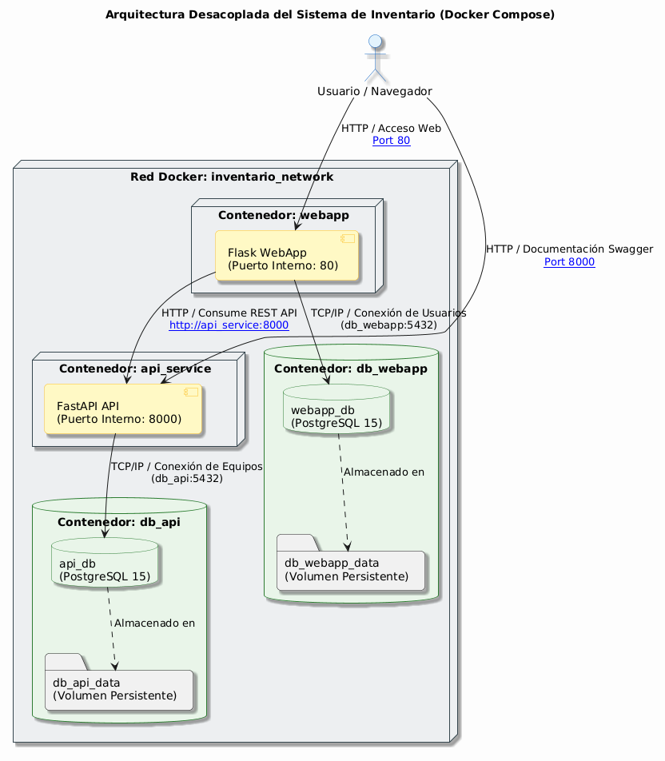

# 🚀 Despliegue Unificado del Sistema de Inventario - Docker Compose

Este repositorio contiene la configuración completa de la capa de despliegue para integrar y poner en producción las aplicaciones de gestión de activos tecnológicos en una arquitectura desacoplada basada en microservicios y contenedores.

---

## 1. Descripción General

El proyecto **inventario-deployment** unifica dos aplicaciones independientes y preexistentes en un entorno local localizable e integrado:
*   **Backend (API):** Construido en FastAPI, expone servicios RESTful para el registro y gestión de los equipos de tecnología, respaldado por su propia base de datos PostgreSQL.
*   **Frontend (WebApp):** Construido en Flask, provee la interfaz gráfica, el registro y control de acceso de usuarios mediante sesiones seguras y persistidas en su propia base de datos PostgreSQL. Se conecta a la API de equipos vía peticiones HTTP internas.

---

## 2. Arquitectura del Sistema

La solución implementa una topología multicapa aislada por una red virtual interna de Docker (`inventario_network`). La persistencia está garantizada por volúmenes con nombre para las bases de datos.

### Diagrama de Arquitectura
El siguiente diagrama detalla el flujo de datos y la relación de comunicación interna entre contenedores y puertos del sistema:



*   **webapp** (Flask, Puerto `80`): Expuesta externamente al usuario final.
*   **db_webapp** (PostgreSQL 15, Puerto Interno `5432`): Base de datos exclusiva de credenciales y registros de usuarios.
*   **api_service** (FastAPI, Puerto `8000`): Expuesta externamente para consumo REST y Swagger.
*   **db_api** (PostgreSQL 15, Puerto Interno `5432`): Base de datos exclusiva para inventario de equipos tecnológicos.

---

## 3. Tecnologías Utilizadas

*   **Docker & Docker Compose** (Orquestación local y virtualización)
*   **PostgreSQL 15 (Alpine)** (Motores de Base de Datos relacionales)
*   **Python 3.11-slim** (Imagen base para las aplicaciones Python)
*   **FastAPI & Uvicorn** (Framework y servidor para la API)
*   **Flask & Gunicorn** (Framework y servidor de producción de la WebApp)
*   **PlantUML** (Modelado del diagrama de arquitectura)

---

## 4. Estructura del Proyecto de Despliegue

La estructura física esperada para el despliegue integrado es la siguiente:

```text
ProyectoFinal/
├── inventario-api/           # Repositorio/carpeta de la API FastAPI
├── inventario-webapp/        # Repositorio/carpeta de la WebApp Flask
└── inventario-deployment/    # Repositorio actual de la capa de despliegue
    ├── docs/
    │   ├── arquitectura.plantuml    # Código fuente de diagramación
    │   ├── arquitectura.png         # Diagrama renderizado
    │   ├── comandos.md              # Guía completa de comandos Docker
    │   └── capturas_requeridas.md   # Checklist para el informe final
    ├── .env.example                 # Plantilla de variables de entorno
    ├── .env                         # Variables de entorno reales (generado)
    ├── docker-compose.yml           # Receta de orquestación de Compose
    └── README.md                    # Manual de usuario principal
```

---

## 5. Requisitos Previos

Antes de ejecutar el despliegue, asegúrese de cumplir con los siguientes prerrequisitos:
1.  **Docker Desktop** (versión 20.10.0 o superior) instalado y activo.
2.  **Docker Compose** (CLI V2 o moderna integrada en Docker).
3.  **Git** para control de versiones de los repositorios.
4.  Mantener libres los puertos locales `80` y `8000` en su máquina anfitrión.

---

## 6. Instalación y Puesta en Marcha

Siga los siguientes pasos para poner en marcha el sistema:

1.  **Clonar / Copiar la estructura:** Asegúrese de tener las carpetas `inventario-api`, `inventario-webapp` e `inventario-deployment` en el mismo directorio raíz (como se describe en la sección 4).
2.  **Navegar a la carpeta de despliegue:**
    ```bash
    cd inventario-deployment
    ```
3.  **Crear el archivo de variables de entorno:**
    Copie la plantilla de variables de entorno suministrada:
    ```bash
    cp .env.example .env
    ```
    *Nota: Si se encuentra en Windows PowerShell, ejecute:*
    ```powershell
    copy .env.example .env
    ```
4.  **Levantar el entorno con Docker Compose:**
    ```bash
    docker compose up --build
    ```
    Docker descargará las imágenes de PostgreSQL, compilará los contenedores locales de la API y de la WebApp, levantará la red e inicializará las bases de datos de forma automática.

---

## 7. Comandos de Operación Rápida

Consulte la lista completa de comandos en [docs/comandos.md](docs/comandos.md) para mayor detalle:

*   **Levantar el despliegue y compilar:** `docker compose up --build`
*   **Detener contenedores:** `docker compose down`
*   **Ver estado de salud y puertos:** `docker compose ps`
*   **Ver logs en tiempo real:** `docker compose logs -f`
*   **Listar proyectos de Compose:** `docker compose ls`
*   **Listar contenedores del sistema:** `docker container ls`

---

## 8. URLs de Acceso Finales

Una vez completada la ejecución correcta del Docker Compose, podrá acceder a los siguientes servicios desde su navegador web:

*   **Interfaz de la WebApp:** [http://localhost](http://localhost) (Puerto default HTTP `80`)
*   **Documentación Interactiva de la API (Swagger UI):** [http://localhost:8000/docs](http://localhost:8000/docs) (Puerto `8000`)
*   **Endpoint directo de Salud API:** [http://localhost:8000/health](http://localhost:8000/health)

---

## 9. Credenciales por Defecto

Para interactuar con la WebApp de administración de inventarios, utilice las siguientes credenciales preestablecidas (sembradas automáticamente en el primer inicio):

*   **Usuario (Email):** `admin@demo.com`
*   **Contraseña:** `admin123`

---

## 10. Solución de Problemas Frecuentes

### Error: "Port 80 is already in use" o "Port 8000 is already in use"
*   **Causa:** Otra aplicación (IIS, Apache, Skype, u otra instancia de FastAPI/Node) está ocupando el puerto en su máquina anfitrión.
*   **Solución:** Detenga el servicio que esté ocupando el puerto, o cambie el mapeo de puertos del servicio respectivo en el archivo `docker-compose.yml` (por ejemplo, cambiar `"80:80"` a `"8080:80"` y `"8000:8000"` a `"8081:8000"`).

### Los contenedores inician pero la WebApp no conecta con la API
*   **Causa:** El contenedor de la API está en proceso de inicio o salud no verificado, o las variables de entorno internas no coinciden.
*   **Solución:** Verifique que el healthcheck de `api_service` y `db_api` esté en `healthy` ejecutando `docker compose ps`. Compruebe en el archivo `.env` que `WEBAPP_API_URL` esté exactamente en `http://api_service:8000` (usando el nombre de servicio de Docker Compose en lugar de localhost).

### Reinicio y Limpieza Completa de Bases de Datos
*   **Causa:** Se desea restablecer el estado inicial y ejecutar las siembras de datos (seeds) desde cero.
*   **Solución:** Detenga el servicio y remueva los volúmenes activos de Docker:
    ```bash
    docker compose down -v
    ```
    Luego vuelva a iniciar con `docker compose up --build`.
